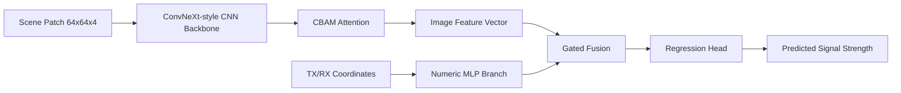

# Wireless Signal Strength Prediction

Deep learning project for point-level wireless signal strength prediction with multimodal feature fusion, attention, and regression modeling.

## Why This Project Matters

Wireless signal estimation is a practical prediction problem with real engineering value. In this project, I built a learning-based pipeline that predicts signal strength from both:

- local spatial context around a receiver position
- structured numeric features describing transmitter and receiver coordinates

Instead of relying on a single input type, the model combines visual and geometric information in one regression system.

## What I Built

This repository contains a PyTorch implementation of a multimodal regression pipeline with:

- a four-channel scene patch encoder
- a numeric MLP branch for coordinate features
- CBAM attention on image features
- gated feature fusion with concat ablation support
- a regression head for scalar signal prediction

The project also includes dataset preparation, training, evaluation, and smoke-test scripts.

## Architecture



## Technical Highlights

- Multimodal learning: combines image-based environment cues with numeric transmitter and receiver coordinates.
- Lightweight backbone design: uses a compact ConvNeXt-style encoder instead of a heavy vision model.
- Attention mechanism: applies CBAM to refine image feature representations before fusion.
- Fusion ablation support: supports both gated fusion and concat fusion for comparison experiments.
- End-to-end training pipeline: includes data preparation, training, checkpointing, evaluation, and simple verification scripts.

## Data Pipeline

The dataset preparation script converts raw RadioMapSeer assets into point-level regression samples.

Each sample contains:

- a `64 x 64 x 4` semantic scene patch
- normalized transmitter and receiver coordinates
- a scalar regression label

The four image channels represent:

- buildings
- roads
- cars
- antenna mask

The preparation step also computes auxiliary geometric features such as line-of-sight obstruction statistics and a distance-based residual target.

## Repository Structure

```text
src/
  data/
    radiomapseer_point_dataset.py
  models/
    backbone.py
    cbam.py
    fusion.py
    mlp_branch.py
    model.py
    regression_head.py
  scripts/
    prepare_radiomapseer_point_dataset.py
    train_radiomapseer_regressor.py
    evaluate_radiomapseer_checkpoint.py
    check_model_forward.py
    check_radiomapseer_dataset.py
  training/
    metrics.py
    train.py
requirements.txt
```

## Setup

```bash
python -m venv .venv
.venv\Scripts\activate
pip install -r requirements.txt
```

## Expected Data Layout

Large datasets and checkpoints are intentionally excluded from this repository.

```text
data/
  processed/
    radiomapseer_point_residual_v6_400maps_multichannel/
      images/
      metadata/
        samples.csv
```

## Run The Pipeline

Prepare processed samples:

```bash
python src/scripts/prepare_radiomapseer_point_dataset.py --radiomapseer-root <raw_dataset_dir> --output-root data/processed/radiomapseer_point_residual_v6_400maps_multichannel
```

Train the model:

```bash
python src/scripts/train_radiomapseer_regressor.py
```

Evaluate a checkpoint:

```bash
python src/scripts/evaluate_radiomapseer_checkpoint.py --dataset-root <processed_dataset_dir> --checkpoint <checkpoint_path>
```

Quick smoke tests:

```bash
python src/scripts/check_radiomapseer_dataset.py
python src/scripts/check_model_forward.py
```

## Engineering Decisions

- Kept the repository lightweight by excluding multi-GB raw data, processed samples, and training artifacts.
- Normalized default script paths to English directory names so the codebase is easier to reuse on other machines.
- Structured the project into clear modules for data handling, modeling, training, and runnable entry points.

## Notes For Reviewers

This repository is intended to showcase modeling design, code organization, and end-to-end pipeline thinking. It does not bundle the original dataset or final experiment outputs, but it preserves the core implementation logic of the project.
